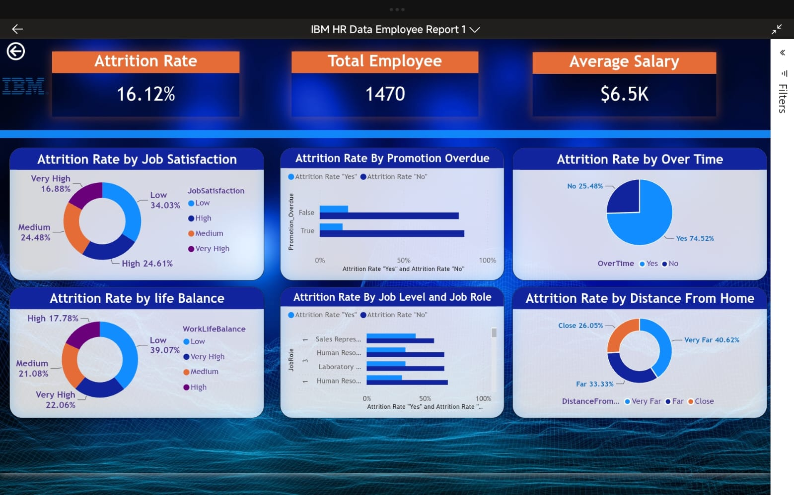
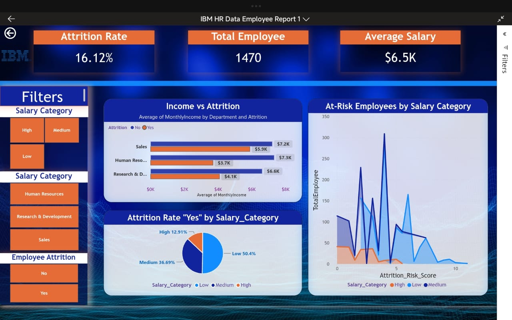
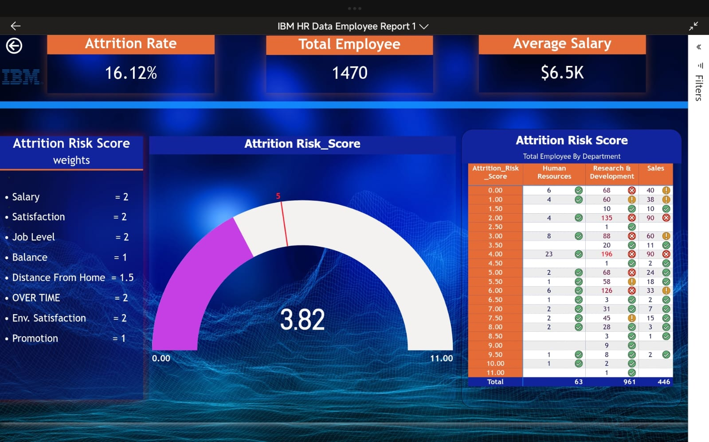

# HR Analytics Dashboard | Power BI

## Project Overview

This project is an interactive HR Analytics Dashboard built using Power BI to analyze employee attrition, workforce trends, and the key factors affecting employee turnover.

The dashboard transforms raw HR data into meaningful insights that support data-driven HR decision-making.

---

## Objectives

- Analyze employee attrition.
- Monitor workforce demographics.
- Identify the main drivers of employee turnover.
- Track employee satisfaction and work-life balance.
- Support HR decisions using data.

---

## Tools & Technologies

- Power BI
- Power Query
- DAX
- Microsoft Excel

---

## Dashboard Pages

### Executive Summary
- Total Employees
- Attrition Rate
- Average Salary
- Average Age
- Key Performance Indicators (KPIs)

### Employee Experience
- Job Satisfaction
- Environment Satisfaction
- Work-Life Balance
- Overtime Analysis

### Salary Analysis
- Salary Distribution
- Attrition by Salary Level

### Attrition Risk Analysis
- High-Risk Employees
- Risk Factors
- Department Analysis

---

## Key Insights

- Employees with lower salaries have the highest attrition rate.
- Frequent overtime is associated with increased employee turnover.
- Poor work-life balance significantly impacts employee retention.
- Employee satisfaction plays an important role in reducing attrition.

---

## Dashboard Preview

### Executive Summary

### Employee Experience

### Salary Analysis

### Attrition Risk Analysis

---

## Files Included

- Power BI Report (.pbix)
- Dashboard Images
- README Documentation

---

## Author

**Hossam Taha**

**Aspiring Data Analyst | Power BI | SQL | Excel**
